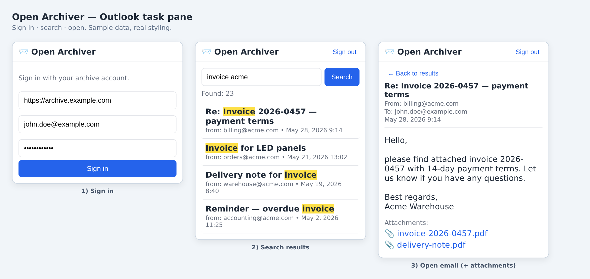

# Outlook Open Archiver

Search and read your [**Open Archiver**](https://github.com/LogicLabs-OU/OpenArchiver) email archive **directly from Outlook** — or from **any browser** as a standalone web app / PWA.

This is the Outlook counterpart to the excellent [thunderbird-openarchiver](https://github.com/lanzalibre/thunderbird-openarchiver) extension. Because Outlook add-ins are web‑based (Office.js), the **same code works in New Outlook for Windows, classic Outlook, Outlook on the web and Mac** — and the very same files double as a standalone progressive web app.

> ⚠️ This project is **not affiliated** with Microsoft or the Open Archiver team. Use at your own risk. AGPL‑3.0.

---

## Screenshot


## Features
- 🔎 Full‑text search of the archive from a task pane inside Outlook
- 🎚️ Optional filters — by sender, recipient and date range (collapsible panel)
- 📧 Open any archived message — headers, HTML/plain body (rendered in a sandboxed iframe), and attachments as downloads
- 👤 **Per‑user**: signs in with the user's own Open Archiver account (JWT), so each person sees only what their role allows
- 🌐 **Bonus standalone web app / PWA** — same search & viewer at the site root, usable on mobile and desktop without Outlook
- 🧩 No server‑side component of its own — talks only to the Open Archiver REST API

## How it works
```
Outlook (task pane)  ─┐
                      │  HTTPS (Bearer JWT)
Browser / PWA        ─┴────────────►  reverse proxy (same origin)
                                          ├── /v1/*  → Open Archiver API
                                          └── /*     → these static files
```
1. User signs in → `POST /v1/auth/login` → JWT (stored locally).
2. Search → `GET /v1/search?keywords=…`.
3. Open → `GET /v1/archived-emails/{id}` → storage path → `GET /v1/storage/download?path=…` → `.eml` → parsed in‑browser with [postal‑mime](https://github.com/postalsys/postal-mime) → rendered.

Serving the static files **and** proxying `/v1` under **one origin** means there is **no CORS** to configure.

## Layout
```
public/            ← web root (deploy this)
  manifest.xml         Outlook add-in manifest (replace ARCHIV_HOST)
  taskpane.{html,css,js}   Outlook task pane
  index.html, app.js, webmanifest.json   standalone web app / PWA
  vendor/postal-mime.js    bundled MIME parser (no runtime CDN)
  assets/icon-*.png        icons
Caddyfile          example reverse proxy (static + /v1 proxy, same origin)
deploy.sh          example deploy helper
docs/preview.html  visual preview of the three states
```

## Prerequisites
- A running **Open Archiver** instance (its REST API, default port `4000`).
- **HTTPS** with a trusted certificate — Office add‑ins and PWAs require it.
- Open Archiver **user accounts** for the people who will use it (each signs in with their own).

## Setup

### 1. Reverse proxy (same origin)
Point a hostname (e.g. `archive.example.com`) at the static files and proxy `/v1` to the Open Archiver backend. **Caddy** example (`Caddyfile`):
```caddyfile
archive.example.com {
    encode gzip
    handle /v1/* { reverse_proxy YOUR_OA_BACKEND_HOST:4000 }
    handle      { root * /var/www/outlook-openarchiver/public; file_server }
}
```
With **nginx / Nginx Proxy Manager** it's equivalent: forward the domain to the box, serve `public/`, and proxy `/v1` to the OA backend. (Caddy/NPM obtain the Let's Encrypt cert for you.)

### 2. Deploy the files
Copy `public/` to your web root and set the host in the manifest:
```bash
sed -i 's/ARCHIV_HOST/archive.example.com/g' public/manifest.xml
# copy public/* to the server root referenced by your proxy
```

### 3a. Use it in Outlook
- **Per‑user (sideload):** Outlook → *Get Add‑ins → My add‑ins → Custom Add‑ins → Add from URL* → `https://archive.example.com/manifest.xml`.
- **Org‑wide (admin):** Microsoft 365 admin center → **Settings → Integrated apps → Upload custom apps** → provide the manifest URL → assign users → deploy. *(Propagation can take from minutes up to 24–72 h even when status shows "OK".)*

The button **Open Archiver** appears when a message is open (ribbon group *Add‑ins → More apps*), and opens the task pane.

### 3b. Use it as a standalone web app
Just open `https://archive.example.com/` in any browser, sign in, search. On mobile/desktop use **"Add to Home Screen" / "Install"** to get it as an app (it ships a web manifest).

## Configuration
- `manifest.xml` — replace `ARCHIV_HOST`; generate your own `<Id>` GUID if deploying multiple variants in one tenant.
- API base auto‑detects the current origin (same‑origin proxy). The login form lets you override it if the API lives elsewhere (then you must enable CORS on Open Archiver for this origin).

## Security
- Untrusted email HTML is rendered in a **`sandbox`ed `<iframe>`** (no scripts, no parent access).
- All user‑supplied strings are escaped before insertion into the DOM.
- The JWT is stored client‑side (Outlook roaming settings / `localStorage`).
- `office.js` is loaded from Microsoft's required CDN (standard for Office add‑ins).

## Troubleshooting
- **Admin upload "fails / not valid":** validate with `npx office-addin-manifest validate manifest.xml`. (Common: `RequestedHeight` must be ≤ 450 for ItemRead.)
- **"App launch failed — not configured for single sign‑on":** you launched it from the *My Apps* / left rail as a standalone app. This is a **message add‑in** — open it from within an email instead.
- **Button doesn't appear after admin deploy:** propagation delay — fully restart Outlook and wait (up to 24–72 h). Verify the app is *Deployed* and *assigned* to the user.
- **Custom sideload missing ("Add from URL"):** your tenant disables user sideload → use the admin (Integrated apps) path.

## Credits
- Inspired by [thunderbird-openarchiver](https://github.com/lanzalibre/thunderbird-openarchiver).
- Built for [Open Archiver](https://github.com/LogicLabs-OU/OpenArchiver).
- MIME parsing by [postal-mime](https://github.com/postalsys/postal-mime).

## License
AGPL‑3.0‑or‑later — see [LICENSE](LICENSE).
